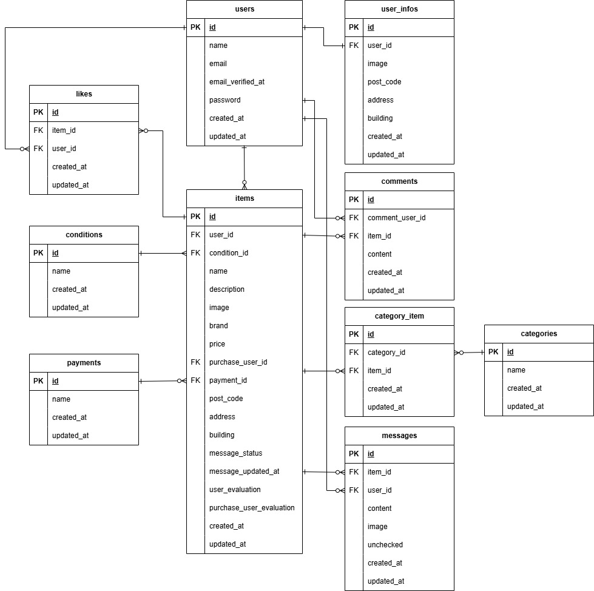

# フリマアプリ

## Dockerビルド
1. GitHubからリポジトリをクローン
``` bash
git clone git@github.com:takayuki345/freemarket_ext3.git
```
2. DockerDesktopアプリを起動
3. dockerコンテナ群の起動
``` bash
docker compose up -d --build
```
### Laravel環境構築
1. phpコンテナに入る
``` bash
docker compose exec php bash
```
2. composerのインストール
``` bash
composer install
```
3. .env.exampleファイルから.envをコピー作成
``` bash
cp .env.exampla .env
```
4. .envファイルの内容を以下のようにメンテナンス
``` text
DB_CONNECTION=mysql
DB_HOST=mysql
DB_PORT=3306
DB_DATABASE=laravel_db
DB_USERNAME=laravel_user
DB_PASSWORD=laravel_pass

        （中略）

MAIL_FROM_ADDRESS=test@example.com（任意のホスト送信メールアドレス）

        （中略）

STRIPE_PUBLIC_KEY="（公開可能キー）"
STRIPE_SECRET_KEY="（シークレットキー）"
```
5. アプリケーションキーの作成
``` bash
php artisan key:generate
```
6. マイグレーションの実行
``` bash
php artisan migrate
```
7. シーディングの実行
``` bash
php artisan db:seed
```
8. シンボリックリンクの作成
``` bash
php artisan storage:link
```
9. storageディレクトリへテスト画像のコピー
``` bash
cp -r public/test_images/* public/storage
```
10. （上手く起動できない場合に）アクセス権の設定を適用
``` bash
sudo chmod 777 -R src
```
## 使用技術（実行環境）
- php 7.4.9
- Laravel 8.83.29
- Mysql 8.0.26

## ER図


## URL
- 開発環境：http://localhost/
- pypMyAdmin：http://localhost:8080/
- MailHog：http://localhost:8025/

## テスト用ユーザー

``` text
-------------------------
name: test1
email: test1@test
password: test1test1
-------------------------
name: test2
email: test2@test
password: test2test2
-------------------------
name: test3
email: test3@test
password: test3test3
-------------------------
```
